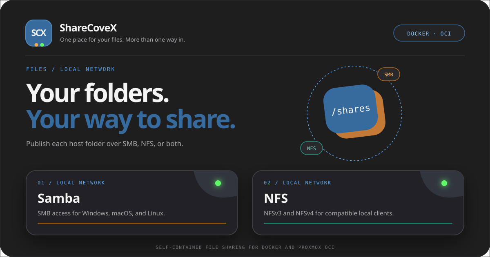

<p align="center"></p>

<h1 align="center">ShareCoveX</h1>
<p align="center"><strong>Share existing host folders over SMB, NFS, or both.</strong></p>
<p align="center"> </p>

ShareCoveX is a container-first file-sharing appliance for Linux hosts and Proxmox OCI/LXC. It discovers folders mounted below `/shares`, lets an administrator publish a complete mount or selected non-overlapping subfolders, and generates Samba and NFS configuration without moving the original data.

> [!IMPORTANT]
> ShareCoveX is a preview, not a replacement for a fully managed NAS. Test backups and restores before trusting important data. The web panel uses HTTP Basic authentication and must stay on a trusted network or behind HTTPS.

## Features

- Independent SMB and NFS settings for every published folder.
- SMB 2.0.2 through 3.1.1, authenticated users, optional read-only guests, client-network restrictions, encryption, browse visibility, and Time Machine profile.
- NFSv3 in ordinary Docker and unprivileged Proxmox OCI/LXC environments.
- NFSv4 through NFS-Ganesha when the runtime can provide real file handles and `CAP_DAC_READ_SEARCH`.
- Multiple panel administrators and Samba users with password rotation and removal.
- Bonjour/mDNS discovery with a configurable server name.
- Server and share pause controls that preserve configuration.
- Per-mount and per-subfolder UID/GID, mode, and effective collaborative-write diagnostics.
- Eight interface languages: English, German, Spanish, French, Italian, Portuguese, Slovak, and Swedish.
- Persistent configuration and Samba account databases in `/config`.

ShareCoveX never creates host mounts, browses arbitrary host paths, deletes shared data, or changes ownership and ACLs automatically.

## Quick start with Docker

Requirements: Linux, Docker Engine, Docker Compose, free TCP ports `445`, `2049`, `20048`, and a trusted local network.

```bash
git clone <repository-url>
cd ShareCoveX
cp .env.example .env
```

Set a unique administrator password and an absolute host folder in `.env`, then start the standard NFSv3 profile:

```bash
docker compose up -d --build
```

The example exposes the panel only on `127.0.0.1:8080`. Reach it locally, through an SSH tunnel, or through a trusted HTTPS reverse proxy. Add one bind mount per source folder:

```yaml
volumes:
  - ./config:/config
  - /srv/shares/media:/shares/media
  - /srv/shares/backups:/shares/backups
```

Each target below `/shares` must have a unique lowercase identifier. ShareCoveX detects the mount after the container is recreated with the new volume.

## NFSv4 profile

NFSv4 uses NFS-Ganesha and is intentionally separate from the standard profile:

```bash
docker compose -f compose.yaml -f compose.nfsv4.yaml up -d --build
```

The host must allow `CAP_DAC_READ_SEARCH`, `open_by_handle_at`, and usable file handles for the mounted filesystem. Many unprivileged LXC environments cannot provide these capabilities; use NFSv3 there. Do not make a container privileged only to bypass an unexplained capability error.

## Filesystem identities and permissions

Network authorization does not override Unix filesystem permissions. By default ShareCoveX uses the collaborative identity `1000:1000` for writable SMB/NFS content. Mounted folders must permit that identity to traverse, read, and write.

In an unprivileged LXC, container IDs are mapped to a host range. For a common map starting at `100000`, container UID `1000` is host UID `101000`. Check the real map instead of assuming it:

```bash
cat /proc/self/uid_map
cat /proc/self/gid_map
```

Prepare ownership or ACLs deliberately on the host. ShareCoveX reports the effective state but never applies `chown`, `chmod`, or `setfacl` to mounted data. An explicit host ACL can preserve the existing owner while granting the mapped service identity access:

```bash
setfacl -R -m u:101000:rwX,m::rwx /srv/shares/media
find /srv/shares/media -type d -exec setfacl -m d:u:101000:rwx,d:m::rwx {} +
```

Adapt the path and mapped ID to your installation. Existing files and new-file inheritance are separate concerns, so verify both from real SMB and NFS clients.

## Protocol notes

### SMB

SMB1 is not offered. The server-wide minimum and maximum can be selected in Settings. Each resource controls users, guest read-only access, client networks, encryption, visibility, and authenticated read/write access. Samba credentials are separate from panel administrator accounts.

### NFS

NFS uses AUTH_SYS identities and trusted client IP/CIDR rules, not Samba users. NFSv3 uses UNFS3 over TCP without NLM locking. A compatible client command is:

```bash
mount -t nfs -o vers=3,proto=tcp,mountproto=tcp,port=2049,mountport=2049,nolock SERVER:/shares/media /mnt/media
```

NFSv4 uses Ganesha when the environment passes the runtime capability probe. Neither profile currently provides Kerberos.

### Time Machine

A Time Machine destination must be a dedicated writable SMB-only resource with at least one authenticated Samba user, no guests, and no NFS. ShareCoveX passes the configured maximum size to Samba so macOS can recycle backups. This is not a host-filesystem quota; enforce a hard limit in the host dataset or volume as well.

## Persistence and upgrades

Back up `/config`. It contains settings, administrator hashes, and Samba's credential database. Shared folders remain separate and need their own backup policy. Recreating or upgrading the application container must retain `/config` and remount every `/shares/<id>` source at the same target.

## Security

- Never expose the HTTP panel directly to the Internet.
- Restrict SMB/NFS ports at the host firewall to trusted networks.
- Use explicit NFS client networks and understand that AUTH_SYS trusts client-provided IDs.
- Prefer authenticated SMB over guest access for private data.
- Review [`SECURITY.md`](SECURITY.md) before deployment.

## Development

The runtime uses Python's standard library; frontend tests require Node.js.

```bash
python3 -m unittest discover -s tests
node --check web/app.js
node --check web/i18n.js
node tests/test_web.js
```

Build the image with:

```bash
docker build -t sharecovex:dev .
```

See [`CONTRIBUTING.md`](CONTRIBUTING.md) for contribution guidelines.

## Current limitations

- Preview software: perform real client and restore tests for your environment.
- Time Machine behavior depends on macOS and the backing filesystem; a successful connection is not proof of a restorable backup.
- NFSv4 is unavailable in ordinary unprivileged LXC containers that cannot expose file handles.
- NFS has no Kerberos support, and the NFSv3 profile has no NLM locking.
- ShareCoveX diagnoses host filesystem access but intentionally does not repair it.

## License

MIT. See [`LICENSE`](LICENSE). Third-party software in the image retains its own licenses; the UNFS3 license is copied into the image at `/usr/share/doc/sharecovex/UNFS3-LICENSE`.
